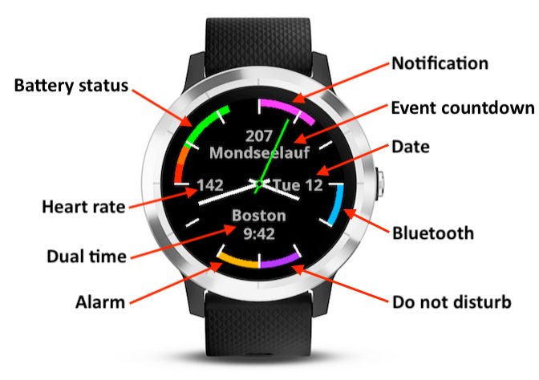
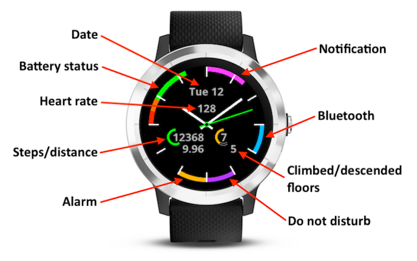
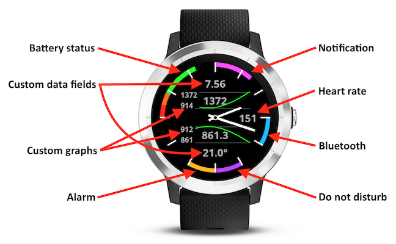

* [Description](#description)
  * [SmartArcs Origin](#smartarcs-origin)
  * [SmartArcs Active](#smartarcs-active)
  * [SmartArcs Trip](#smartarcs-trip)
  * [Settings](#settings)
  * [Power Saver](#power-saver)
    * [Power Saver Settings](#power-saver-settings)
* [Donation](#donation)
* [Feedback](#feedback)
* [Credits](#credits)

SmartArcs is a suite of Garmin watchfaces. They were designed to be clean, minimalist and highly configurable. The suite consists of three watchfaces:
* **SmartArcs Origin** - simply focuses on time, nothing else ([download](https://apps.garmin.com/en-US/apps/073e2cbc-f25e-44b9-ab59-4966fa5abbd6))
* **SmartArcs Active** - gives an overview of your daily activity (steps and floors) ([download](https://apps.garmin.com/en-US/apps/3f5e481a-5f9e-4764-b2d5-5e9b174e2a98))
* **SmartArcs Trip** - shows useful trip data in two configurable data fields and two graphs ([download](https://apps.garmin.com/en-US/apps/a1bfdf21-bde7-4d63-925f-a6a04cb84aff))

## Description
SmartArcs name comes from a common functionality to all three watchfaces - colored arc indicators around the screen to display watch statuses:
* **battery status**
* **number of phone notifications**. First notification is displayed as five minutes arc, each other as one minute arc.
* **Bluetooth connection status**
* **do not disturb status**
* **number of alarms**. First alarm is displayed as five minutes arc, each other as one minute arc.

Watchfaces are updated once each minute. Some watches support updating the screen every second. On those watches SmartArcs can display also:
* **'always on' second hand**
* **heart rate**

*Note: SmartArcs currently does not support every second screen update on watches with AMOLED screen (Venu).*

### SmartArcs Origin
This watchface focuses on time. It can display:
* **number of days to an event**, e.g. number of remaining days to your vacation or next marathon
* **dual time** ('+' means there is already next day in the dual time location, '-' means previous day)
* **date**

### SmartArcs Active
This watchface gives an overview of your daily activity:
* **steps/distance** on the left side. First line displays daily steps, second line walked distance (in kilometers or miles depending on systems settings). Arc shows how you fulfill daily steps goal.
* **floors** on the right side. First line displays climbed floors, second line descended floors. Arc shows how you fulfill daily climbed floors goal.

### SmartArcs Trip
This watchface shows useful trip data in two configurable data fields and two graphs.

#### Data fields options
* daily walked distance
* elevation
* pressure
* temperature

#### Graph options
* elevation
* pressure
* heart rate
* temperature

### Settings
... documentation in progress

### Power Saver
There is no need to update watch screen whole day, e.g. when you sleep. SmartArcs watchfaces (*currently only Origin, it will come to Active and Trip soon*) come with a unique feature, you can set up a period of time when the watch screen is not updated. It can save up to 20% of battery life (measured on *vívoactive 3*).

*Please note that this function saves battery life only when SmartArcs watchface is active (shown on the screen), it has no impact in any other application.*

Garmin does not allow any input method (screen touch, button press) in watchfaces. That's why you cannot invoke screen update by user input in the power saver mode. The only way to refresh the screen is to look at your watch. When you raise the watch to look at it, the watch exits sleep mode and the screen is updated. An attempt to workaround missing watchface input methods is to update the screen in user defined intervals when the watchface is in power saver mode - see next chapter for details.

#### Power Saver Settings
Power saver can be configured in a few ways. It can be enabled:
* **in defined time window** - only in specified time period
* **always** - whole 24 hours

When power saver is enabled the watch screen can be updated:
* **never** - the screen is never updated, you cannot rely on what is displayed. It is indicated by *big* battery icon.
* **5, 10 or 15 minutes** - the screen is regularly updated in defined intervals. You can somehow rely on displayed time. It is indicated by *small* battery icon.

## Donation
SmartArcs watchfaces offer **premium features for free**, e.g. power saver or graphs. I don't plan to make paid or trial watchfaces. If you like SmartArcs watchfaces please consider a [donation](https://paypal.me/RadkoNajman). It is an appreciation of my work and all [donations](https://paypal.me/RadkoNajman) are for a good cause. I resend all [donations](https://paypal.me/RadkoNajman) to non-profit organizations, mainly:

          

**Thank you!**

## Feedback
If you have any comments to SmartArcs watchfaces feel free to [send me a message (okdar@centrum.cz)](mailto:okdar@centrum.cz). You can also write a review in Garmin ConnectIQ Store:
* **SmartArcs Origin** ([review](https://apps.garmin.com/en-US/apps/073e2cbc-f25e-44b9-ab59-4966fa5abbd6#reviews))
* **SmartArcs Active** - ([review](https://apps.garmin.com/en-US/apps/3f5e481a-5f9e-4764-b2d5-5e9b174e2a98#reviews))
* **SmartArcs Trip** - ([review](https://apps.garmin.com/en-US/apps/a1bfdf21-bde7-4d63-925f-a6a04cb84aff#reviews))

## Credits
The idea of arc indicators was inspired by **Activity Classic Watch Face** and **ManniAT Face**.
